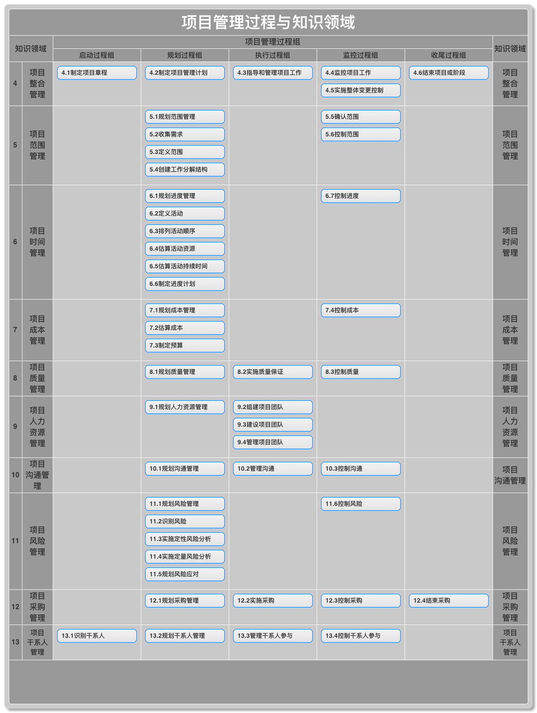
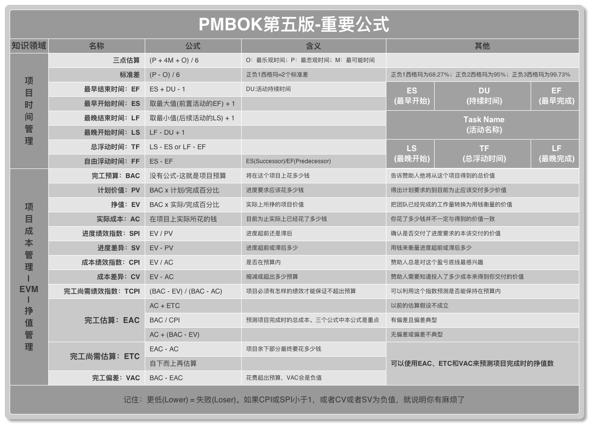

# PMBOK第五版复习笔记 - 传说中的闲人

## 项目管理过程与知识领域

> 十大知识领域记忆：蒸饭时、橙汁人、够疯、才干(整合、范围、时间、成本、质量、人力资源、沟通、风险、采购、干系人)

> 47个过程

编号 | 过程名称 | 知识点 | 
:-: | :-:| :-
4.1 |	制定项目章程 |	编写一份正式批准项目并授权项目经理在项目活动中使用组织资源的正式文件的过程。作用：明确项目边界，确定项目地位，直述高层对项目的支持。由项目以外人员批准，如发起人/PMO/项目组合治理委员会主席。经批准的项目章程标志项目启动（发起人/启动者签字）。尽早任命项目经理，最好在制定项目章程时任命，最晚在规划开始之前。
4.2 |	制定项目管理计划 |	定义、准备、和协调所有子计划，并把它们整合为一份综合项目管理计划的过程。作用，生成一份核心文件，作为所有项目工作的依据。项目管理计划9+2+2。确定项目的执行、监控、收尾的方式。体现如何去管理（HOW）。需渐进明细。是执行过程组的基础。
4.3 |	指导与管理项目工作 |	领导和执行项目管理计划中所确定的工作，实施已批准的变更。作用，对项目工作提供全面管理。开展活动实现目标、创造可交付成果、配备培训管理项目成员、获取管理使用资源、建立并管理沟通渠道、生成绩效数据、提出变更、实施批准的变更、管理风险、实施风险应对活动、管理卖方和供应商、管理关系人及参与、收集记录经验教训、实施批准的过程改进。
4.4 |	监控项目工作 |	跟踪审查报告项目进展、实现项目管理计划中确定的绩效目标的过程。作用：让干系人对项目情况有所了解。贯穿整个项目生命周期，全书唯一输出工作绩效报告。
4.5 |	实施整体变更控制 |	审查变更、批准变更、管理变更，并对变更结果进行沟通。作用：整合角度考虑变更，降低项目风险。贯穿项目始终，项目经理负最终责任。所有变更请求必须书面记录。CCB。配置管理系统的目的：识别变更、分析变更影响、通知干系人；配置控制重点在于可交付成果及各个过程的技术规范，变更控制重点在于识别、记录、控制对项目和产品基准的变更；配置活动：配置识别、配置状态记录、配置核实与审计；CCB的角色在配置控制程序和变更控制程序中定义；如涉及修改章程，则由章程签发者审批。无论变更批准与否，需记录变更日志。
4.6 |	结束项目或阶段 |	完结所有项目管理过程组的所有活动，以正式结束项目或阶段的过程。作用：总结经验教训、正式结束工作、释放资源。确定收尾程序、移交项目成果、完成经验教训总结、文件审核/归档、遣散资源。
5.1 |	规划范围管理 |	创建范围管理计划，书面描述如何定义、确认和控制项目范围的过程。作用：对如何管理范围提供指南和方向。输出范围管理计划和需求管理计划。
5.2 |	收集需求 |	确定、记录并管理干系人的需要和需求。作用：为定义和管理范围奠定基础。包括业务需求、干系人需求、解决方案需求（功能性和非功能性）、项目需求、过渡需求、质量需求。SMART原则需求作为需求基准。
5.3 |	定义范围 |	制定项目和产品详细描述。作用：明确所收集的需求是否在项目范围内，从而明确项目边界。输出项目范围说明书：假设条件制约因素除外责任、产品范围描述、验收标准、可交付成果。项目章程包含高层级信息，范围说明书对项目范围详细描述，需渐进明细。
5.4 |	创建WBS |	把项目可交付成果和项目工作分解成较小的、更易于管理的组件。作用：对可交付成果提供结构化试图。工作结构组织并定义项目的总范围。最底层工作包、第二层规划包。WBS、WBS词典、范围说明书构成范围基准。
5.5 |	确认范围 |	正式验收项目已完成的可交付成果完成程度的过程。不负责对可交付成果的检查（控制质量负责）。输出验收的可交付成果。确认文件需要客户或发起人签字批准。如果项目提前终止，确认范围也要做，要查明并记录完成的水平和程度。
5.6 |	控制范围 |	监督项目和产品的范围状态，管理范围基准变更。作用：对范围基准维护。确保变更经实施整体变更流程控制，防止范围蔓延。
6.1 |	规划进度管理 |	为规划、编制、管理、执行和控制项目进度而制定政策、程序和文档的过程。作用：为管理项目进度提供指南和方向。规定如何报告和评估进度紧急情况。
6.2 |	定义活动 |	识别和记录为完成项目可交付成果而需要采取的具体行动的过程。作用：将工作包分解为活动，作为对项目工作进行估算、进度规划、执行、监督和控制的基础。定义活动过程的最终输出是活动而不是可交付成果，可交付成果是创建WBS过程的输出。
6.3 |	排列活动顺序 |	识别和记录项目活动之间的关系。作用：定义活动之间的逻辑顺序，以便在既定的所有项目制约因素下获得最高的效率。输出项目进度网络图。项目进度网络图可包括项目的全部细节，也可只列出一项或多项概括性活动。
6.4 |	估算活动资源 |	估算每项活动所需的材料、人员、设备、用品的品种和数量。作用：明确完成活动所需要的资源种类、数量和特性，以便做出更准确的成本和持续时间估算。
6.5 |	估算活动持续时间 |	根据资源估算的结果，估算完成单项活动所需工作时段数的过程。作用：确定完成每个活动所需花费的时间量。由项目团队中最熟悉具体活动的个人或小组来完成。渐进明细。首先估算出完成活动所需的工作量和计划投入该活动的资源数量，然后结合项目日历和资源日历来估算。68.26\95.46\99.73
6.6 |	制定进度计划 |	分析活动顺序、持续时间、资源需求和进度制约因素，创建项目进度模型的过程。作用：形成包含各个项目活动的计划日期的进度模型。进度基准：经批准的进度模型。进度模型可有多个，进度基准只有一个，进度模型和进度计划一一对应。
6.7 |	控制进度 |	监督项目活动状态，更新项目进展，管理进度基准变更，以实现计划。作用：提供发现进度偏离的方法，从而可以及时采取纠正和预防措施，降低风险。本过程中输入的进度计划，是指最新版本的项目进度计划。注意：进度控制工具属于组织过程资产，进度规划工具属于事业环境因素。
7.1 |	规划成本管理 |	为规划、管理、花费和控制项目成本而制定政策、程序和文档的过程。作用：为整个项目中如何管理项目成本提供指南和方向。
7.2 |	估算成本 |	对完成项目活动所需资金进行近似估算的过程。作用：确定完成项目工作所需的成本数额。活动成本估算不需要批准。注意质量成本工具。粗量级估算-25%~75%，后期详细估算-5%~10%。
7.3 |	制定预算 |	汇总所有单个活动或工作包的估算成本，建议一个经批准的成本基准的过程。作用：确定成本基准，可据此监督和控制项目绩效。成本基准是经过批准且按时间段分配的项目预算，不包括管理储备。管理储备一旦使用，需纳入成本基准，并对成本基准更新。
7.4 |	控制成本 |	监督项目状态，以更新项目成本，管理成本基准变更的过程。作用：发现实际与计划的差异，以便采取纠正措施，降低风险。重点挣值计算。
8.1 |	规划质量管理 |	识别项目及其可交付成果的质量要求和标准，并书面描述项目将如何证明符合质量要求的过程。作用：为整个项目中如何管理和确认质量提供指南和方向。质量是一系列内在特性满足要求的程度；质量管理要兼顾项目管理和产品两方面；项目管理和质量管理的共识：客户满意（符合要求、适合使用）、预防胜于检查、持续改进、管理层的责任（85%）、质量成本（一致性和非一致性）；休哈特提出、戴明完善的PDCA是质量改进的基础。强调标准。
8.2 |	实施质量保证 |	审计质量要求和质量控制测量结果，确保采用合理的标准和操作性定义的过程；质保部门会监督质量保证过程；实施质量保证为持续过程改进创造条件；持续过程改进，不断地改进所有过程的质量，减少浪费，消除非增值活动，使各过程在更高的效率或效果水平上进行；用到了控制质量的输出；建立信心。质量审计识别最佳实践。强调过程和信心。
8.3 |	控制质量 |	监督并记录质量活动执行结果，以便评估绩效，并推荐必要变更的过程。作用：识别原因，建议或采取相应措施消除原因；确认可交付成果满足需求。注意输出确认的变更。强调可交付成果。
9.1 |	规划人力资源管理 |	识别和记录角色、职责、所需技能、报告关系，编制人员配备管理计划的过程；特别关注稀缺或有限人力资源的可得性。层级型、矩阵型、文本型。RACI矩阵。人力资源管理计划包括角色和职责、项目组织图、人员配备管理计划。
9.2 |	组建项目团队 |	确认人力资源的可用情况，并为开展项目活动而组建团队的过程。该过程关注团队成员兴趣（事业环境因素）。项目管理团队对选择成员不一定拥有直接控制权，需要谈判；应在诸多计划中说明，缺少所需人力资源可能造成的影响。
9.3 |	建设项目团队 |	提高工作能力，促进团队成员互动，改善团队整体氛围，提高项目绩效。团队协作是项目成功的关键。注意基本规则工具。事业环境因素更新。
9.4 |	管理项目团队 |	跟踪团队成员工作表现，提供反馈，解决问题并管理团队变更，优化项目绩效。作用：影响团队行为，管理冲突，解决问题，并评估团队成员的绩效。事业环境因素更新。为绩效评估提供输入，为组织数据库增加经验教训。
10.1 |	规划沟通管理 |	根据干系人的信息需要和要求及组织的可用资产情况，制定合适的项目沟通方式和计划的过程。作用：识别和记录与干系人的最有效率且最有效果的沟通方式。项目资源只能用来沟通有利于项目成功的信息，或者那些因缺乏沟通造成失败的信息。
10.2 |	管理沟通 |	根据沟通管理计划，生成、收集、分发、储存、检索及最终处置项目信息的过程。作用：促进项目干系人之间实现有效率有效果的沟通。报告绩效。
10.3 |	控制沟通 |	对沟通进行监督和控制的过程，以确保满足项目干系人对信息的需求。作用：随时确保信息流动最优化。
11.1 |	规划风险管理 |	定义如何实施风险管理活动；确保风险管理的程度、类型和可见度与风险以及项目对组织的重要性相匹配；为风险管理活动安排资源和时间。并为评估风险奠定一个共同认可的基础；在项目构思阶段开始，规划早期结束。
11.2 |	识别风险 |	判断哪些风险会影响项目并记录其特征的过程。作用：对已有风险文档化，并为项目团队预测未来事件积累知识和技能。鼓励全员参加识别，反复进行的过程，反复的频率和每轮参与者因具体情况而异；以统一的格式记录风险，便于对比其影响。SWOT分析工具。
11.3 |	实施定性风险分析 |	评估并综合分析风险的发生概率和影响，对风险优先排序，为后续分析或行动提供基础的过程；评估概率与影响会受到干系人的风险态度的影响，应该加以管理避免偏颇；概率影响层级定义，减少了偏颇；风险行动的紧迫性会放大其重要性（风险紧迫性评估）；对风险相关数据质量的评估（风险数据质量评估）。
11.4 |	实施定量风险分析 |	已识别风险对项目整体目标的影响实施定量分析。对象为定性分析中被确定为重大影响的风险。作用：产生量化风险信息，支持决策，降低项目不确定性。；在不确定情况下进行决策的一种量化方法；反复展开，了解风险发展趋势；决定增减风险管理措施。蒙特卡洛技术。
11.5 |	规划风险应对 |	针对项目目标，制定提高计划、降低威胁的方案和措施；需要为应对措施分配一名责任人；把应对措施的成本和活动添加进成本预算、进度计划、项目管理计划中。注意该过程输出项目文件更新含变更请求。
11.6 |	控制风险 |	实施风险应对、跟踪以识别风险、监测残余风险、识别新风险、评估风险过程有效性；其他目的：假设条件是否还有效、已评估的风险是否发生变化、风险政策和程序是否得到遵守、是否需要调整进度和成本应急储备；风险应对责任人应定期向项目经理汇报；更新组织过程资产。风险审计，检查并记录风险应对措施及风险管理过程的有效性。
12.1 |	规划采购管理 |	记录项目采购决策、明确采购方法、识别潜在卖方。自制或外购分析，采购什么、如何采购、采购多少、何时采购。供方选择标准。输出变更请求。
12.2 |	实施采购 |	获取卖方应答、选择卖方并授予合同的过程（签订合同）。项目经理不一定是采购谈判的主谈人；合同里包含争议解决过程（ADR)；合同是法律关系；合同可以由于买方便利、一方违约或双方协商而提前终止。
12.3 |	控制采购 |	管理采购关系、监督合同执行情况，并根据需要实施变更和采取纠正措施的过程（管理合同）。许多组织设置总的合同管理部门；虽然采购管理员可以是项目团队成员，但他通常向另一个部门的经理报告；监督向卖方付款（支付系统）；考察卖方在未来项目中实施类似工作的能力（采购绩效审查、检查与审计），谈判是解决所有索赔和争议的首选方法。
12.4 |	结束采购 |	完结单次项目采购的过程。产品核实、可交付产品移交、财务结算、组织过程资产更新（采购档案、可交付成果验收、经验教训文档）、更新档案；买方的采购管理员向卖方发出关于合同已经完成的正式书面通知。为结束合同，需收集全部采购文档，并建立索引加以归档。项目经理无权宣布采购结束。
13.1 |	识别干系人 |	识别干系人，分析期望和影响。应在项目或阶段的早期识别。权利利益方格、权力影响方格、影响作用方格、凸显方格（权力、紧急程度、合法性）。
13.2 |	规划干系人管理 |	基于对干系人需要、利益及对项目成功的潜在影响的分析，制定合适的管理策略，以有效调动干系人参与的过程。干系人管理的内容比改善沟通更多，也比管理团队更多，由项目经理定期开展。
13.3 |	管理干系人参与 |	与干系人进行沟通和协作，以满足其需要与期望，解决实际出现的问题，并促进干系人合理参与项目活动的过程。作用：提升干系人支持，降低抵制，提高项目成功的机会。
13.4 |	控制干系人参与 |	全面监督干系人之间的关系，调整策略和计划，以调动干系人参与的过程。作用：维持和提升干系人参与活动的效率和效果。

***

## PMP-ITTO大全 （to be continue）

> 119个工具

编号 | 工具名称 | 知识点 | 
:-: | :-:| :-
1 |	SWOT分析 |	产生于组织优势的各种机会，产生于组织劣势的各种威胁；机会克服劣势的程度，优势抵消威胁的程度；一种力场分析
2 |	报告绩效 |	对项目文档（各种计划、假设条件、以往的项目档案、其他信息）进行结构化审查；项目计划的质量和项目计划与假设条件以及项目需求的匹配程度，都是风险指示器
3 |	备选方案分析 |	对已识别的可选方案进行评估的技术，用来决定选择哪种方案或使用何种方法来执行项目工作。分析不同的资源配置方案
4 |	备选方案生成 |	制定尽可能多的潜在可选方案。头脑风暴、横向思维、备选方案分析。
5 |	变更控制工具 |	便于开展配置和变更管理使用的手动或自动的工具，用来管理变更请求和后续的决策。需关注沟通，帮助CCB成员履行职责，向相关干系人传达决定。
6 |	标杆对照 |	组织内部或外部，同一或不同领域，两个项目对比，识别最佳实践。
7 |	采购绩效审查 |	结构化的审查；审查卖方在规定的成本和进度内完成项目范围和达到质量要求的情况；履约情况的好坏；相对于采购工作说明书的进展情况以及未遵循合同的情况，以便买方量化评价卖方的能力或无能；对卖方所编文件的审查，以及对卖方的质量审计
8 |	采购审计 |	对所有采购过程的结构化审查，找出供其他采购或执行组织其他项目的经验教训。
9 |	采购谈判 |	谈判以双方达成一致并签订合同告终；项目经理可以不是采购合同的主谈人；策略：不在现场、权力有限、最后期限、撤退、拖延、出人意料、公平合理、既成事实、好家伙坏家伙
10 |	参数估算 |	利用历史数据与其他变量之间的统计关系；正确性取决于参数模型的成熟度和基础数据的可靠性。用于估算时间和估算成本。
11 |	产品分析 |	用于以产品为可交付成果的项目；把概况性的产品转化成有形的可交付成果；包括产品分解、系统分析、需求分析、系统工程、价值工程、价值分析（以最低成本识别功能并确立价值提供价值）
12 |	成本汇总 |	活动-工作包-WBS更高层次（控制账户）
13 |	成本效益分析 |	对质量活动进行商业论证；边际成本=边际收益，此时质量是最好的，质量是免费的
14 |	冲突管理 |	冲突来源：资源、优先级（前期），进度（后期），行政程序、技术意见、个人工作风格（项目执行中）；冲突是正常的、因项目而存在、对事不对人、对现在不对过去、开诚布公；影响冲突解决方法的因素：重要性、紧迫性、双方立场、永久或暂时解决的动机；解决方法：合作/解决（备选方案，双赢）、妥协/调解（各退一步，双输，一定程度满意）、缓解/包容（smoothing）（双赢，强调一致性，和稀泥，未解决冲突）、撤退回避（离开退出，未解决冲突)、强制（输赢，暂时解决，最不好的方式，用于紧急事件）；解决方式多采用非正式口头沟通
15 |	储备分析 |	在进行持续时间或成本估算时，应考虑应急储备来应对进度或成本的不确定性；可以按一定百分比，时间段，或定量分析增加应急储备。蒙特卡洛模拟法。控制风险也需用到储备分析。
16 |	定量风险分析和建模技术 |	敏感性分析，哪些风险对项目具有最大的潜在影响，固定其他不确定因素，考虑单个因素的变化对目标产生多大影响，龙卷风图用于比较很不稳定的变量和相对稳定的变量之间的相对重要性和相对影响；预期货币价值，建立在风险中立的基础上，决策树；建模和模拟，用一个模型，技术项目个细节方面的不确定性对项目目标的潜在影响，反复模拟通常使用蒙特卡洛技术，对成本风险分析使用成本估算模拟，对进度风险分析使用进度网络图和持续时间估算进行模拟
17 |	独立估算 |	自行编制或邀请外部估算师进行成本估算，作为标杆比较卖方报价，如存在明显差异，说明采购工作说明书有缺陷或卖方未能理解相应采购工作说明书；当业主特别自信自己的标的时使用
18 |	多标准决策分析 |	制定选择标准，对候选团队成员定级打分。可用性、成本、经验、能力
19 |	发布的估算数据 |	一些组织定期发布的最新的生产率信息与资源单位成本。涉及众多门类的劳务、材料和设备。
20 |	访谈 |	与干系人直接交谈，提出预设或即兴的问题，一对一、一对多、多对多
21 |	分解 |	自上而下；100%；规划包，滚动式规划；识别和分析可交付成果和相关工作、确定分解结构和编排方法、自上而下、标志编码、核实充分必要；WBS和活动清单可以依次编制，也可以同时编制；WBS和WBS词典是制定最终活动清单的基础
22 |	分析技术 |	根据可能的项目或环境变量的变化，以及它们与其他变量之间的关系，采用分析技术预测潜在后果。收尾过程使用回归分析、趋势分析。干系人，C当前参与程度，D期望参与程度
23 |	风险分类 |	可按照共同的风险来源（RBS）、受影响的项目工作（WBS）、其他因素风险进行分类；明确受不确定性最大的区域；以根本原因分类，有助于制定有效的风险应对措施
24 |	风险概率和影响评估 |	发生的可能性和潜在的影响；对所有已识别风险都要评估
25 |	风险紧迫性评估 |	把近期就需要应对的风险当做更紧急的风险；综合风险风险紧迫性和从概率影响矩阵得到的风险等级，得到最终的重要性等级
26 |	风险审计 |	检查并记录风险应对措施和风险管理过程的有效性；项目经理按照风险管理计划开展风险审计
27 |	风险数据质量评估 |	为确保定性风险分析可信，应该使用准确无偏倚的数据；评估有关风险数据对项目管理可用性的技术；考察人们对风险的理解，考察风险数据的准确、可靠、完整
28 |	风险再评估 |	识别新风险、对现有风险再评估、删除已过时风险；再评估的次数和详细水平，应相对于项目目标的项目进展而定
29 |	概率和影响矩阵 |	排序；可以针对目标评定风险等级，也可以为项目确定总的风险等级来反映项目偏好；对于深灰色高风险威胁，采用优先措施和积极应对策略；对于中灰色低风险威胁，课加入观察清单或增加应急储备；对于深灰色高风险机会，应该首先抓住；对于中灰色低风险机会，应该加以监督
30 |	干系人分析 |	系统的收集和分析各种定性定量信息，以便确定项目中应该确定哪些人的利益；识别所有干系人及相关信息（角色、部门、利益、知识水平、影响力）；通过识别干系人可能产生的影响和提供的帮助，对干系人分类（权力利益、权力影响、影响作用、凸显模型-权力/紧迫度/合法性),通过排序有效分配精力，策划如何施加影响提高积极作用降低消极作用
31 |	沟通方法 |	交互式，双方或多方多向信息交换，确保全体参与者对某一话题达成共识最好的办法，会议、视频会议；推式，把信息发送给特定接收方，能确保信息发送，但不保证接收和理解，如电子邮件；拉式，信息量很大或受众很多的情况下使用，要求接收方自主自行的获取信息，如内网、电子在线课程、经验教训数据库、知识库、卓越百分网。
32 |	沟通技术 |	可以采用各种方法传达信息：会议、口头、网络；传递：语言占7%、语气语调占38%（副语言），动作表情眼神占55%（非语言）；复杂问题正式书面、电子邮件备忘录会议邀请非正式书面
33 |	沟通模型 |	编码、信息和反馈信息、媒介、噪声、解码；确认收到信息；发送方有责任发送清晰完整的信息，并确认信息已被正确理解；接收方有责任确保完整的接收信息，正确的理解信息，并告知收悉或作出回应
34 |	沟通需求分析 |	确定干系人的信息需求，以及信息对干系人的价值；资源只用来沟通对项目成功有利的信息；潜在沟通数量n(n-1)/2；最重要的事，谁和谁沟通，沟通何种信息；确定沟通需求的信息：组织结构图、项目组织以及干系人间的职责关系、学科专业；内部需求、外部需求、有多少人在什么地方参与项目；来自干系人登记册和干系人管理计划的干系人信息
35 |	关键链法 |	根据有限的资源来调整进度计划的进度网络分析技术；在确定了关键路径后，在考虑资源可用性，制定资源约束型进度计划；资源约束型关键路径就是关键链；增加“非工作进度活动的”缓冲时间，来应对不确定性；项目缓冲放在关键链末端，确保项目不因关键链的延误而延误；接驳缓冲放在关键链与非关键链结合点，确保关键链不因非关键链的延误而延误；缓冲时间长短，由活动的不确定性决定；确定了缓冲进度活动，就可以按可能的最晚开始最晚结束时间安排活动；关键链法不再管理总浮动时间，而是管理剩余缓冲与剩余的任务链持续时间的匹配关系
36 |	关键路径法 |	不考虑资源限制的前提下，沿着进度网络路径顺推或逆推；关键路径上的活动，总浮动时间为0或负数（LS-ES)，指不延误项目完成日期前提下，某活动可以推迟的时间；自由浮动时间，指不延误任一紧后活动最早开始时间，活动可以推迟的时间（ES-EF)；关键路径所用时间是项目最短时间，可以有多条。看讲义。
37 |	观察 |	干系人难说或不愿说，旁站式、体验式，又称工作跟踪。
38 |	观察和交谈 |	随时了解；监督可交付成果进展、了解团队成员成就感、人际关系
39 |	管理技能 |	指导和控制一群人，以便协调他们的行为，来完成个人无法完成的目标；演示技能、谈判、公开演讲、写作技能
40 |	广告 |	在出版物刊登广告，扩充潜在卖方。政府在互联网上公布采购信息。
41 |	滚动式规划 |	一种迭代式（渐进明细）的规划方式；近期详细，远期粗略，不改变范围。
42 |	过程分析 |	识别过程所需改进、发现非增值活动、包括根本原因分析、用于识别问题探究根本原因并制定预防措施
43 |	合同变更控制系统 |	规定了修改合同的流程；文书工作、审批层次、跟踪系统、争议解决；只允许为实现合同既定目的而变更，不能追加无关工作，不能为把工作转移给自己或他人而变更，不能在收尾时变更；文字优于阿拉伯数字、规范优于图纸、单价优于总价
44 |	核对单分析 |	可以根据历史信息和知识编制核对单，也可以把RBS底层作为核对单；不全面，需考虑核对单未列事项；在收尾过程，应该对核对单审查，并根据经验教训改进
45 |	会议 |	面对面的会议效果最好。会后要形成书面的会议纪要和行动方案。虚拟会议需额外组织和准备。
46 |	积极风险或机会的应对策略 |	开拓，消除积极风险相关的不确定性，确保机会出现，把组织最好资源给项目；分享，第三方；提高，提高概率和影响，使风险触发因素最大化；接受，不主动追求
47 |	基本规则 |	对可接受行为作出明确规定；一旦确立，必须遵守。有利于团队成员相互了解对方的价值观。
48 |	集中办公 |	许多或全部最活跃的成员在一个物理空间办公；作战室、紧密矩阵。增强团队工作能力。
49 |	记录管理系统 |	管理合同、采购文件和相关记录；作为项目管理信息系统的一部分；包含可检索的合同文件及往来函件
50 |	技术绩效测量 |	把技术成果与项目管理计划相比较；技术绩效量化的测量指标；预测范围方面的成功程度，揭示项目面临的技术风险程度
51 |	绩效审查 |	测量、对比和分析进度绩效，决定需不需要针对进度偏差采取纠正措施；关键路径和次关键路径的活动；关键链剩余缓冲时间与所需缓冲时间的比较。趋势分析、关键路径法、关键链法、挣值管理。
52 |	假设分析 |	检验假设条件在项目中的有效性，并识别如果变化或错误导致的风险
53 |	检查 |	展开测量、审查与确认等活动，以判断工作和可交付成果符合要求及产品验收标准；也称为审查、产品审查、审计、巡检。可在任何层次上进行，可用于确认缺陷补救。
54 |	检查与审计 |	卖方的工作过程或可交付成果对合同的遵守程度
55 |	建模技术 |	假设情景分析、模拟。基于已有，考虑未来情景并评估可行性，为客服或减轻影响编制应急和应对计划。蒙特卡洛技术。
56 |	建议书评估技术 |	加权系统（建议书排序）、筛选系统（特殊要求或资质）、卖方评级系统
57 |	焦点小组 |	召集预定的干系人和主题专家，由一位受过训练的主持人引导大家进行互动式讨论。比一对一访谈更热烈。
58 |	紧前关系绘图法(PDM) |	矩形或方框表示活动，箭头表示逻辑关系,PDM又称节点法AON，有四种逻辑关系FS/FF/SF/SS；箭线图ADM有虚活动；条件绘图法CDM，可能有回路；PDM用于关键路径法
59 |	进度计划编制工具 |	可与其他项目管理软件联合应用；自动化的
60 |	进度网络分析 |	利用多种分析技术计算活动未完部分ESLSEFLF：关键路径法、关键链法、假设情景分析、资源优化
61 |	进度压缩 |	不改变项目范围；赶工，以最小的成本最大限度的压缩进度，对关键路径上的活动，加班、额外资源，可能增加成本、导致风险；快速跟进，把顺序执行的活动并行进行，可能导致风险和返工。SPI<1，CPI>1，表示进度滞后，预算有结余，可以赶工。
62 |	类比估算 |	已过去类似项目的参数值为基准，来估算未来项目的同类参数或指标；成本低、耗时少、准确性较低；在项目早起，信息不足时使用；如果以往的活动，是本质上相似，并且估算的成员具有必要的专业知识，则最为可靠。用于估算时间和估算成本。
63 |	历史关系 |	变量之间存在据以参数估算、类比估算的历史关系；根据参数，建立数学模型；可靠性取决于：历史数据准确、参数可以量化、模型可以调整
64 |	卖方投标分析 |	竞争性招标选择卖方的项目，项目团队展开额外的估算，以审查卖方报价
65 |	培训 |	提高团队成员能力的全部活动；把培训作为项目工作的一部分；安照人力资源计划安排培训；根据管理项目团队得到的信息，安排额外的培训。项目团队的培训直接成本、管理层面的培训间接成本。
66 |	偏差分析 |	利用项目绩效测量结果，评估偏离基准的程度和原因，并决定是否采取纠正和预防措施；是一种事后审查
67 |	偏差与趋势分析 |	挣值、比较。与基准的偏差可能表明威胁或机会的潜在影响。
68 |	七种基本质量工具 |	音控爬散直河流。因果图（石川图、鱼骨图）、控制图、帕累托图、散点图、直方图、核查表、流程图。因果图找出所有原因、控制图找趋势、帕累托图找最主要最重要原因、散点图两个变量间关系、直方图不考虑时间因素描述集中趋势分散程度统计分布形状、核查表收集数据查对清单、流程图显示步骤和分支向上查原因向下找预测
69 |	其他质量规划工具 |	头脑风暴、名义小组技术（排序）、力场分析（显示变更推力和阻力）、质量管理和控制工具
70 |	确定依赖关系 |	强制性依赖；选择性依赖，经验决定，选择快速跟进时可能会调整或去除，应全面记录选择性依赖关系；外部依赖，不受项目团队控制；内部依赖，项目活动之间的紧前关系。
71 |	群体创新技术 |	头脑风暴（速度快、易受影响）、名义小组技术（投票排创意）、概念/思维导图（整合创意成图）、亲和图（创意分组）、多标准决策分析（用矩阵对方案评估和排序）
72 |	群体决策技术 |	为达到某种期望成果对对个未来行动方案进行评估；一致、大多数、相对多数、独裁。估算活动持续时间和估算成本有德尔菲技术
73 |	人际关系技能 |	软技能：领导力、团队建设、激励、沟通、谈判、影响力、决策、政治和文化意识；项目管理团队用以减轻团队成员压力，加强合作。干系人，建立信任、解决冲突、积极倾听、克服变更阻力
74 |	人际交往 |	在组织、行业或职业环境中，与他人正式或非正式的互动；了解政治、人际因素的有效途径；在项目初期非常有用
75 |	人事评测工具 |	洞察成员优势劣势，评估偏好愿望、处理整理信息方式、制定决策及喜欢如何与人打交道。
76 |	认可与奖励 |	满足需求的奖励为有效奖励，在整个项目生命周期中给予。只有少数团队成员获得的赢-输（零和）奖励，会破坏团队凝聚力。
77 |	三点估算 |	通过考虑估算中的不确定性和风险可以提高估算的准确性；起源于计划评审技术；(p+4m+o)/6，标准差p-o/6(不能相加），方差可以累加；正态分布，68.26、95.46、99.73。用于估算时间和估算成本。
78 |	审查已批准的变更请求 |	对所有已批准的变更请求进行审查，以核实它们是否已按批准的方式得到实施。
79 |	实验设计 |	一种统计方法，识别多个因素对正在开发的流程和正在生产的产品的变量产生的影响；田口法；确定测试的类别、数量以及这些测试对质量成本的影响；有助于产品或过程的优化，用来降低产品性能对各种环境变化或制造过程变化的敏感度
80 |	市场调研 |	考察行业情况和供应商能力，了解市场情况，优化采购目标
81 |	数据收集和展示技术 |	访谈，利用经验和历史数据，应记录风险区间的合理性及所依据的假设条件，以便洞察风险分析的可靠性和可信度；概率分布，连续概率分布代表数值的不确定性，不连续概率分布代表不确定事件（两点、泊松），贝塔分布和三角分布常用于定量分析，均匀分布一般用于早期概念阶段
82 |	索赔管理 |	有争议的变更称为索赔、争议、诉求；按照合同规定对索赔进行记录、处理、监督、管理；如果双方无法自行解决索赔，则按照合同中替代争议解决程序ADR处理；谈判是解决所有索赔和争议的首选方法
83 |	谈判 |	谈判的对象：职能经理、其他共享资源的项目、外部；影响力非常重要
84 |	提前量与滞后量 |	都是针对紧后活动而言。提前量用负号，滞后量用正号。不能改变活动的逻辑关系。
85 |	统计抽样 |	抽取部分样本用于检查；规模和频率在规划质量是确定，以考虑质量成本
86 |	投标人会议 |	标前会议，确保所有潜在卖方对本想采购有清晰且一致的理解。所有问题的回答都要写入采购文件；公平
87 |	图解技术 |	因果图（石川图鱼骨图，识别风险起因）；系统图流程图（各要素之间的联系以及因果传导机制，预测及原因）；影响图（变量与结果之间的因果关系、事件时间顺序）
88 |	团队建设活动 |	形成（高指令）、震荡（高指令高支持）、规范（少指导高支持）、成熟（授权型）、解散（指导型）
89 |	完工尚需绩效指数 |	(BAC-EV)/(BAC-AC)、(BAC-EV)/(EAC-AC)
90 |	文档审查 |	对项目文档（各种计划、假设条件、以往的项目档案、其他信息）进行结构化审查；项目计划的质量和项目计划与假设条件以及项目需求的匹配程度，都是风险指示器
91 |	文件分析 |	分析文档，识别需求。
92 |	问卷调查 |	设计书面问题，受众多样化，地理位置分散，开展统计分析
93 |	系统交互图 |	对产品范围可视化描述，人机互动。
94 |	项目管理软件 |	有助于规划、组织、管理可用资源，优化资源的使用
95 |	项目管理信息系统 |	作为事业环境因素的一部分，为指导和管理项目执行提供自动化工具，如进度计划软件、配置管理系统、信息收集与发布系统，或进入其他在线自动化系统的网络页面。自动收集和报告KPI。
96 |	项目绩效评估 |	澄清角色和职责、提供建设性反馈、发现未知或未决问题、制定个人培训计划、确定未来各时期目标
97 |	消极风险或威胁的应对策略 |	回避，改变计划、目标，项目早期澄清需求、获取信息、改善沟通；转移，财务、保险、合同；减轻，提前采取行动降低风险可能性和影响；接受，被动接受只是记录，主动接受就是备用计划/应急储备
98 |	信息管理系统 |	管理和分发项目信息的工具。纸质文件、电子通信、项目管理电子工具（基于网页界面的进度管理工具和项目管理软件、会议和虚拟办公支持软件、门户网站和协同工作管理工具）
99 |	信息收集技术 |	头脑风暴、德尔菲、访谈、根本原因分析
100 |	虚拟团队 |	具有共同目标、很少或没有时间面对面工作；沟通规划最重要
101 |	引导技术 |	引导者可以用来帮助团队和个人完成项目活动的关键技术。含头脑风暴、冲突处理、问题解决和会议管理等。
102 |	引导式研讨会 |	跨职能；快速定义跨职能需求和协调干系人差异的重要技术；能够比单项会议更快的发现和解决问题；联合应用开发、质量功能展开
103 |	应急应对策略 |	对某些特定事件，专门指定的应对措施；应急应对策略就是只有在某些条件发生时才实施的应对计划；如果风险的发生有充分预警信号，就需要制定应急应对策略；对预警信号要进行定义和跟踪
104 |	预测 |	自下而上估算EAC，最准确、但会干扰项目工作、还会产生额外成本；假设未来绩效将会改进 ` EAC=BAC-EV+AC `；假设按目前情况继续进行` EAC=BAC/CPI ` ；假设有个必须完成的进度要求 ` EAC=AC+(BAC-EV)/(SPI * CPI) `看讲义。
105 |	预分派 |	投标文件中指定的、专有技能的特定人员、项目章程中指定的
106 |	原型法 |	渐进明细故事板，广告、电影
107 |	招募 |	从外部获得所需人员
108 |	挣值管理 |	` PV/BCWS `计划工作量计划单价（WBS甘特图成本基准）、` EV/BCWP ` 实际工作量计划单价、AC/ACWP实际工作量实际单价；` CV/SV `；` SPI/CPI ` ；` EAC=BAC-EV+AC `、 ` BAC/CPI ` 、 ` AC+ETC ` ； ` 50/50 ` 原则最常用。看讲义。
109 |	支付系统 |	团队中具有相应权利的成员证明卖方令人满意的完成了相关工作；通过买方应付账款系统向卖方支付；必须严格按照合同条款并加以记录
110 |	质量成本 |	预防、评价及返工（是否符合要求）发生的成本；一致性（预防、评估）非一致性（外部失效、内部失效）；业务流失也是外部非一致性成本
111 |	质量管理和控制工具 |	亲过关树有火炬。亲和图、过程决策程序图、关联图、树形图、优先矩阵（计算、排序）、活动网络图、矩阵图。
112 |	质量审计 |	确定项目活动是否遵守组织和项目的政策过程和程序。识别最佳实践、确认已批准的变更实施情况。
113 |	专家判断 |	具有专业知识或专业培训经历的任何小组或个人。整合知识域全程使用工具。专家判断对识别风险最有用
114 |	资金限制平衡 |	平衡资金支出水平，调整项目进度计划，添加强制日期
115 |	资源优化技术 |	用于关键路径法分析后；如果资源有限或只在特定时间内有效，或为保证资源使用量处于恒定水平，需要资源平衡；往往会导致关键路径改变。资源平滑一般不改变关键路径，可以理解为浮动时间内的资源平衡，无法实现所有资源的优化。
116 |	自下而上的估算 |	把活动进一步细分，然后估算资源，再把资源汇总得到每一个活动的资源需求；其准确性取决于较低层级工作的复杂性和规模。用于估算成本和估算资源。
117 |	自制或外购分析 |	考虑成本、资源、专利、组织战略、机密；租赁和购买，考虑间接成本。考试注意公式
118 |	组织理论 |	阐述个人、团队、组织部门的行为方式；提高编制人力资源计划的效率。灵活使用领导风格。
119 |	组织图和职位描述 |	层级型：在每个部门下列出工作包；矩阵型：工作包或活动与团队成员的关系，如果团队是由内部和外部组成，有助于确保对角色和期望的明确划分（RACI图）；文本型

> 丧心病狂的ITTO记忆口诀（工具）

编号 | 名称 | 记忆口诀
:-: | :-:| :-
1 |	收集需求 |	焦点访谈引二群问官员标细蚊。（焦点小组、访谈、引导式研讨会、群体创新、群体决策、问卷调查、观察、原型法、标杆对照、系统交互图、文件分析）。注意文档审查是在识别风险里面。
2 |	定义范围 |	专备引产（专家判断、备选方案生成、引导式研讨会、产品分析）。注意备选方案分析是在估算活动资源里面，观察和交谈是在管理项目团队里面。
3 |	七种基本质量工具 |	音控爬散直河流。因果图（石川图、鱼骨图）、控制图、帕累托图、散点图、直方图、核查表、流程图。
4 |	质量管理和控制工具 |	亲过关树有火炬。亲和图、过程决策程序图、关联图、树形图、优先矩阵（计算、排序）、活动网络图、矩阵图。

> 输入输出

编号 | IO名称 | 记忆口诀
:-: | :-:| :-
1 |	变更请求 |	直接或间接、外部或内部提出、自选或法律强制；可以口头提出，但必须书面记录；每个变更请求必须或批准或否决；预防措施，降低风险消极后果的概率；纠偏措施，针对实际已经出现的不利偏差；缺陷补救，针对已出现的可交付成果缺陷；更新，针对文件和计划
2 |	变更日志 |	一份记录了项目过程中所做变更的综合清单，通常包括变更日期和变更对时间、成本及风险的影响。不管批准与否都要记入变更日志。
3 |	采购工作说明书 |	详细描述拟采购的产品、服务或成果，以便潜在卖方确定其承接工作的能力；是采购文件（征求潜在卖方的建议书）的一部分
4 |	采购管理计划 |	如何确定潜在卖方、编制采购文件、如何评标、采用何种合同、何种采购、如何进行自制外购决策、是否独立估算、制约因素假设条件
5 |	采购文件 |	依据价格选择，标书、投标、报价；依据技术等选择，建议书；应便于卖方作答。包含采购工作说明书和供方选择标准
6 |	成本管理计划 |	HOW
7 |	成本基准 |	经批准的按时间段分配的项目预算；是每个时间段的预算之和，用S曲线表示；又叫绩效测量基准。不包括任何管理储备。
8 |	成本预测 |	EAC/ETC。EAC=AC+ETC。非典型ETC=BAC-EV，典型ETC=（BAC-EV）/CPI。看讲义公式
9 |	范围管理计划 |	HOW
10 |	范围基准 |	包括项目范围说明书、WBS、WBS词典。进度管理计划三基准之一
11 |	风险登记册 |	已识别风险及根本原因；潜在应对措施。注意从实施定性风险分析到控制风险过程输出的项目文件更新。
12 |	风险管理计划 |	包括方法论、角色与职责、风险类别、概率和影响定义、概率影响矩阵（通常由组织来设定）、预算、时间安排、修订的干系人承受力、报告格式、跟踪
13 |	干系人登记册 |	基本信息、评估信息（主要期望主要影响在哪个阶段对项目影响最大）、干系人分类
14 |	干系人管理计划 |	如何提高干系人正面影响、降低负面影响：对项目有显著影响的重要干系人、项目现阶段的干系人沟通需求、希望干系人参与项目的程度、干系人分组以及按组别管理的措施；保密（敏感信息），注意哪些列入干系人管理策略及详细程度，由PM确定。包含干系人登记册内容
15 |	工作绩效报告 |	如状态报告、备忘录、论证报告、信息札记、电子报表、推荐意见或情况更新
16 |	工作绩效数据 |	执行过程的输出，如工作完成百分比、质量和技术绩效测量值、进度活动的开始和结束日期、变更请求的数量、缺陷数量、实际成本和实际持续时间
17 |	工作绩效信息 |	监控过程的输出，如可交付成果的状况、变更请求的执行状况、预测的完工估算
18 |	供方选择标准 |	是采购文件的一部分；可以是主观的或客观的；简单的采购，看价格；复杂的采购，考虑卖方对需求理解、生命周期成本、管理方法、财务能力、技术能力
19 |	沟通管理计划 |	沟通计划通常包括：干系人沟通需求、需要的沟通信息、发布信息的原因、发布信息的时限和频率、发布信息的人员、发布机密信息的人员、接收信息的人员、发布信息的沟通方法和技术、问题上报流程、沟通计划的更新和优化、通用术语表、信息流向、工作流程（授权顺序）、报告清单、会议计划、沟通制约因素（法规技术组织政策）、各种会议和邮件的模板
20 |	估算依据 |	成本估算所需的信息的种类和数量，因应用领域而异；清晰、完整的说明成本估算是如何得到的；估算依据、假设条件、制约因素、估算区间、置信水平
21 |	过程改进计划 |	详细说明进行过程分析的各个步骤，以便识别增值活动；包括：过程边界、过程配置、过程测量指标、绩效改进目标
22 |	核实的可交付成果 |	经过控制质量过程的检查，被证实为正确的已完成的可交付成果。关注可交付成果的正确性及是否满足质量需求
23 |	活动成本估算 |	进度活动的预计成本，包括执行和完成该活动所需的全部资源的成本，包括全部的成本类型和成本元素。成本估算可以是汇总的或详细分列的。
24 |	活动持续时间估算 |	是对完成某项活动所需工作时段数的量化估计；不包括时间滞后量；可以指出一定变动区间
25 |	活动清单 |	包含项目所需全部进度活动的清单，包括每个活动的标识和足够详细的工作描述
26 |	活动属性 |	每项活动所具有的多重属性，以扩展对活动的描述；随时间严谨，项目初期只包括活动名称、活动标志、WBS标志，活动完成时包括活动编码、活动描述、紧前紧后活动、逻辑关系、时间提前滞后量、资源需求、强制日期、假设条件、制约因素；用于识别执行工作负责人、地点、活动类型（人力投入、分立、分摊，为计算挣值）；在项目报告中，基于活动属性，对进度活动进行选择、分类、排序
27 |	活动资源需求 |	每项活动所需资源类型和数量；汇总得到工作包的资源估算；资源估算的依据以及假设
28 |	结束的采购 |	买方授权的采购管理员向卖方发出关于合同已经完成的正式书面通知；正式结束采购的要求通常在合同条款和条件中定义，并包括在采购管理计划中
29 |	进度管理计划 |	HOW
30 |	进度基准 |	经批准的进度模型。包含基准开始日期和结束日期。项目管理计划三大基准之一。进度基准变更特指影响到项目完工日期的改变。并非进度基准的任何数据改变都可看作基准变更，不影响项目最终完工日期的进度改变可被称为进度信息改变，项目经理就有权批准。
31 |	进度数据 |	至少包括进度里程碑、进度活动、活动属性；可以做支持细节的信息包括：按时段计列的资源需求（以资源直方图表示），备选的进度计划，应急储备；现金流预测、订购与交付进度安排等
32 |	进度预测 |	根据已有的信息和知识，对项目未来的情况和事件进行的估算或预计。
33 |	可交付成果 |	在某一过程、阶段或项目完成时，必须产出的任何独特并可核实的产品、成果或服务能力
34 |	里程碑清单 |	项目中重要的时点或事件，持续时间为0；列出了项目中所有里程碑，并注明哪些是强制哪些选择性的
35 |	卖方建议书 |	卖方为响应采购文件包而编制的建议书，是一套基本的信息组合
36 |	批准的变更请求 |	变更请求经过实施整体变更控制，得到状态更新，显示哪些变更已得到批准
37 |	其他过程的输出 |	5到13章输出的基准和子计划以及项目管理计划更新
38 |	确认的变更 |	对变更或补救过的对象进行检查，做出拒绝或接受的决定，并把决定通知干系人，被拒绝的对象可能需要返工。
39 |	人力资源管理计划 |	是关于如何定义、配备、管理、控制以及最终遣散项目人力资源的指南，包括：角色和职责（职责和职权相匹配时，团队成员能最好的开展工作）；项目组织机构图（展示团队成员及其报告方式）；人员配备管理计划（人员招募、资源日历、人员遣散计划、培训需要、认可和奖励、合规性、安全）
40 |	商业论证 |	商业论证或类似文件能从商业角度提供必要的信息，决定项目是否值得投资
41 |	事业环境因素 |	被动限制的。看PMBOK。注意进度规划工具属于事业环境因素，进度控制工具属于组织过程资产。
42 |	事业环境因素更新 |	建设项目团队和管理项目团队的输出。
43 |	团队绩效评价 |	建设项目团队的输出。根据项目的技术成功度、进度绩效、成本绩效来评价团队绩效；以任务和结果为导向，项目结果符合要求，是高绩效团队的特征；团队有效性的指标：个人能力的改进、团队能力的改进、离职率（非正常）降低；团队凝聚力加强
44 |	问题日志 |	用来记录和监督问题的解决情况；可以促进沟通、确保对问题的统一认识；问题需要加以处理，以便在相关干系人之间保持良好的、建设性的关系；根据问题紧急性、潜在影响，对问题进行描述和分类；指定责任人和完成日期；未解决的问题往往是冲突和项目延迟的主要原因
45 |	项目范围说明书 |	假设条件制约因素除外责任、可交付成果、产品范围、验收标准
46 |	项目工作说明书 |	业务需要、产品范围描述、战略计划；对项目所需交付的产品或服务的叙述性说明；内部由启动者或发起人提供，外部由客户提供，可以是招标文件或合同的一部分
47 |	项目沟通 |	绩效报告、可交付成果状态、进度进展情况和已发生的成本。受信息的紧急性和影响、信息传递方法、信息机密程度影响。
48 |	项目管理计划 |	说明项目将如何执行、监督和控制的文件。9+2+2+3。需批准，一旦被确定为基准，只有在提出变更请求并经实施整体变更控制过程批准后，才能变更。
49 |	项目管理计划更新 |	NONE
50 |	项目进度计划 |	进度计划至少包括每项活动的计划开始和完成时间，是进度模型的输出；在未确认资源分配和计划日期之前，进度计划只是初步的，一般要在项目管理计划完成之前，对进度计划进行确认；里程碑图（主要可交付成果或对外接口）、横道图（甘特图，概括性进度计划，按WBS结构罗列活动，用于向管理层汇报）、进度网络图（既显示逻辑又显示进度活动，可采用节点图也可采用时标进度网络图/逻辑横道图）
51 |	项目进度网络图 |	展示项目各进度活动及其逻辑（依赖）关系的图形；应附有简要的文字说明排序基本方法；对任何异常的活动序列也要说明
52 |	项目人员分派 |	把合适的人员分配到位；团队成员名录、致团队成员备忘录；插项目组织图和进度计划
53 |	项目日历 |	表示进度活动的可用工作日和工作班次的日历
54 |	项目文件 |	NONE
55 |	项目文件更新 |	NONE
56 |	项目章程 |	由项目启动者或发起人发布，正式批准项目成立，并授权项目经理动用组织资源。记录业务需要、假设条件、制约因素、对客户需要和高层级需求的理解、需要交付的新产品、服务、成果；项目目的和批准原因；可测量的项目目标和相关成功标准；项目总体要求和概括性描述；高层级需求；假设条件和制约因素；高层级项目描述和边界定义；高层级风险（主要风险）；总体里程碑计划；总体预算；干系人清单；审批要求；委派的项目经理及其权责；发起人或其他批准章程人员的姓名和职权
57 |	项目资金需求 |	根据成本基准，确定总资金需求和阶段性资金需求；项目的资金投入通常以增量而非连续的方式；成本基准中既包括预计的债务也包括预计的支出；总的资金需求应该包括管理储备。可说明资金来源
58 |	协议 |	用于明确项目初步意向的任何文件或沟通，形式有合同、谅解备忘录（MOU）、协议书、口头协议和电子邮件等。协议定义了启动项目的初衷。当作外部项目时，需要有合同
59 |	需求跟踪矩阵 |	连接需求与需求源；把需求同业务目标、项目目标结合起来；为整个项目生命周期中跟踪需求提供了方法，确保需求文件批准的每一项需求在项目结束时都能实现；为管理产品范围变更提供了框架；应记录各项需求的属性；是承上启下的文件，确保高层目标落实到了工作。为确保干系人满意，需要补充属性：稳定性、复杂性和验收标准。
60 |	需求管理计划 |	描述了在整个项目生命周期里如何分析、记录和管理需求；生命周期各阶段间的关系对如何管理需求有很大影响；内容包括如何规划跟踪汇报各种需求活动、配置管理活动、需求排序过程、产品测量指标以及使用这些指标的理由、需求跟踪结构
61 |	需求文件 |	描述单一需求如何满足与项目相关的业务需求；业务需求、干系人需求、解决方案需求（功能性非功能性看PMBOK第112页举例）、项目需求、过渡需求、与需求相关的假设条件、依赖关系和制约因素。
62 |	选定的卖方 |	根据投标书或建议书评价结果，被认为有竞争力、并与买方签订草案的卖方；高风险、高价值、复杂的合同需要高级管理层审批
63 |	验收的可交付成果 |	符合验收标准的可交付成果应该由客户或发起人正式签字批准，应该获得正式的文件。关注可交付成果的验收
64 |	质量测量指标 |	一种操作性定义，用具体的语言描述项目和产品的属性以及质量控制过程如何对其进行测量；如：准时性、成本控制、缺陷频率、故障性、可用性、可靠性、测量覆盖度等。正负3西格玛。
65 |	质量管理计划 |	定义如何实施执行组织的质量政策，包括项目的质量保证、质量控制和持续过程改进方法；某成果测试已完成，客户不相信该检测，说明质量计划不周
66 |	质量核对单 |	结构化的工具，用来核实所要求的步骤是否都已得到执行。应该覆盖在范围基准中定义的验收标准。
67 |	质量控制测量结果 |	按照规划质量管理过程中规定的格式，对质量控制活动结果的书面记录
68 |	资源分解结构 |	按资源类别和类型划分的资源层级结构；类别包括人力、材料、设备、用品，类型包括技术水平、等级水平；有助于结合资源使用情况，组织和报告项目进度数据
69 |	资源日历 |	资源的属性（数量与技能水平的信息）、来源地和可用时间；项目后期，可能仅限于熟悉项目的人员
70 |	自制或外购决策 |	外部采购或自行生产的决定；为风险转移而购买保险或履约担保的决定
71 |	组织过程资产 |	流程与程序（模板）、共享知识库（项目档案、配置管理知识库）。主动应用的
72 |	组织过程资产更新	|
73 |	最终产品、服务或成果移交 |	移交项目所产出的最终产品、服务或成果（在阶段收尾时，则是移交该阶段所产出的中间产品、服务或成果）

> 丧心病狂的ITTO记忆口诀（输入输出）

编号 | IO名称 | 记忆口诀
:- | :- | :-
1 |	变更请求 |	管团有管沟无，剩余执行和监控，采购有规划。团购团购，规划采购，管团不管够，执行和监控。
2 |	工作绩效报告 |	实施整体变更控制，管团管沟，控采控风
3 |	工作绩效数据 |	指导与管理项目工作输出，其他知识领域所有监控过程组的输入。
4 |	工作绩效信息 |	监控项目工作输入，其他知识领域所有监控过程组的输出。
5 |	识别风险的输入 |	施主~范进想成疯子，2活人才干（事业环境因素、组织过程资产、范围基准、项目文件、成本管理计划、风险管理计划、质量管理计划、活动成本估算、活动持续时间估算、人力资源管理计划、采购文件、干系人登记册）
6 |	事业环境因素 |	整合监控有，剩余知识域无监控。整合启动至监控，范围一四规，时间成本质量采购规划完，风险一至四，人力资源沟通干系人一二
7 |	项目管理计划 |	制定项目管理计划输出，整合知识域剩余过程组的输入，其余知识域规1和监控，采购有收尾（结束采购）
8 |	项目管理计划更新 |	整合、成本、质量、沟通、采购、干系人执行和监控。人力资源组团和管团。时间、风险最后一个规和监控。范围最后一个监控。执行和监控，无建团，加时加风最后规，最后煎饭。
9 |	项目章程 |	项目章程作为输入：制定项目管理计划、老三范进成疯干（规划范围管理、收集需求、定义范围、规划进度管理、规划成本管理、规划风险管理、识别干系人）
10 |	组织过程资产 |	（收集需求、确认范围）、实施质量保证、建设项目团队、（规划风险应对、控制风险）、（控制采购、结束采购）、控制干系人参与——（收需确范，质保建团，十一、十二、十三、倒数221）不含组织过程资产的输入，其他过程需输入组织过程资产
11 |	组织过程资产更新 |	所有知识域最后一个过程，外加控制采购，执行干钩子（管理干系人参与、管理沟通、实施质量保证）

***

## PMBOK第五版重要公式汇总

***

# PMBOK第五版ITTO记忆终极版

## 1、全部过程的输入概括

PMBOK指南列出了 **72个输入输出**，其中有 **64个输入**、**66个输出**。只有极少数输入(**6个**)是来自项目外部的，它们是**事业环境因素、组织过程资产、项目工作说明书、商业论证、协议、卖方建议书**；其他全部输入都是项目内部产生的，即某个项目管理过程的输出，并用于后续的相关过程。**注意:协议也由项目内部产生的**。

> PMP考试中会有不少题目与输入输出、工具技术有关。考生不仅需要理解所有输入输出和工具技术，而且需要记忆。如果只是一个一个地机械式记忆，困难很大。考生应该在理解的基础上，采用归纳法，以提高记忆的效率与效果，并进一步加深理解。本节旨在对全部过程的输入进行归纳。在理解的基础上记忆项目管理过程的输入输出、工具技术，这是必需的。

### 1.1事业环境因素和组织过程资产

实际工作中，几乎每项工作和每个过程都在不同程度上受事业环境因素的影响，并需要利用组织过程资产。不过，PMBOK指南中并没有对全部过程都列出这两个输入。PMBOK指南中总共 **27** 个过程使用“事业环境因素”这个输入，其中有:
-	**全部(2个)启动过程** 。
-	**20个规划过程** 。规划过程组只有 ~~**4**~~ 个过程没用事业环境因素，即 ~~**收集需求、定义范围、制定预算和规划风险应对**~~。
-	**3个执行过程**。即 **指导与管理项目工作、组建项目团队、管理沟通**。
-	**2个监控过程**。即 **监控项目工作、实施整体变更控制**。
事业环境因素是 **全部启动过程和绝大多数规划过程** 的输入，这是为了强调在项目的启动和规划阶段就认真、全面、系统地考虑环境因素，编制好项目章程和项目计划，为以后的项目执行、监控和收尾奠定坚实基础。
在整个项目生命周期中，都要利用组织过程资产。在 **全部47个过程** 中，对 **38** 个过程列出了“组织过程资产”这个输入，只有以下 ~~**9**~~ 个过程不用“组织过程资产”:

-	**2个规划过程**，即 ~~**收集需求、规划风险应对**~~ 。     
-	**2个执行过程**，即 ~~**实施质量保证、建设项目团队**~~ 。
-	**4个监控过程**，即 ~~**确认范围、监控风险、控制采购、控制干系人参与**~~ 。  
-	**1个收尾过程**，即 ~~**结束采购**~~ 。

### 1.2项目管理计划

PMBOK指南各过程的文件类输出，可以分成两类:一类是 **项目管理计划及其组成部分** ;另一类是 **项目文件的组成部分(各种各样的项目文件)** 。项目管理计划是关于管理工作的安排以及 **高层次的项目要求(项目基准)** 。规划阶段所编制的项目文件，则是关于技术工作的安排以及细节性的项目要求(为了确保基准的实现)。**不属于项目管理计划的任何文件，都是项目文件的组成部分**。这些输出又成为最终的成果或后续其他过程的输入。
让我们先考察下作为输入的 **项目管理计划** 。 **23** 个过程使用 **项目管理计划** 作为输入:
-	**9个分项管理计划编制过程**。除 ~~**整合管理知识领域**~~ 以外，后九大知识领域都分别有一个“规划某某管理过程”，即编制相应知识领域的分项管理计划。各分项管理计划是综合的项目管理计划的组成部分。把综合的项目管理计划列作各分项管理计划编制过程的输入，是为了体现在编制某分项管理计划时，需要参考项目管理计划中已有的内容，也是为了体现项目管理计划编制工作的迭代性质。
-	**1个执行过程**。即 **指导与管理项目工作**。其他执行过程都使用作为项目管理计划的组成部分的相应分项管理计划作为输入。    . 
-	**全部11个监控过程**。    
-	**全部2个收尾过程**。
在PMBOK指南中，下列分项管理计划也作为输入出现(按知识领域排列): 
-	**范围管理计划**，是收集需求、定义范围和创建WBS三个过程的输入；
-	**需求管理计划**，是收集需求的输入；
-	**进度管理计划**，是定义活动、排列活动顺序、估算活动资源、估算活动持续时间、制定进度计划、识别风险和实施定量风险分析七个过程的输入； 
-	**成本管理计划**，是估算成本、制定预算、识别风险和实施定量风险分析四个过程的输入；
-	**质量管理计划**，是实施质量保证和识别风险两个过程的输入。 . 过程改进计划，是实施质量保证过程的输入；
-	**人力资源管理计划**，是估算成本、组建项目团队、建设项目团队、管理项目团队和识别风险五个过程的输入；
-	**沟通管理计划**，是管理沟通和管理干系人参与两个过程的输入；
-	**风险管理计划**，是识别风险、实施定性风险分析、实施定量风险分析和规划；
-	**风险应对四个过程的输入** ; 
- **采购管理计划** ，是 **实施采购** 的输入。
-	**干系人管理计划**，是 **收集需求** 和 **管理干系人参与** 两个过程的输入。 
作为输入出现的分项基准包括:
-	**范围基准**，是 **定义活动、估算成本、制定预算、识别风险和实施定性风险分析**五个过程的输入。
-	作为范围基准的组成部分的 **项目范围说明书**，是**创建WBS、排列活动顺序、估算活动持续时间和制定进度计划**四个过程的输入。
**全部分项管理计划和分项基准(合称 `其他过程的输出`)，都是制定项目管理计划过程的输入**。
PMBOK指南使用项目管理计划及其组成部分作为输入，有如下规律:
-	除 ~~**2个启动过程**~~ 以外(启动阶段，尚无项目管理计划)，其他每个过程的输入中都至少有一个是 **项目管理计划或其组成部分**。
-	除 ~~**整合管理**~~ 以外，每个知识领域的编制分项管理计划的过程，都使用 **项目管理计划** 作为输入。
-	除 ~~**上述9个编制分项管理计划**~~ 的过程以外，其他全部规划过程都用 **项目管理计划** 的 **相应组成部分** 而不是 ~~**项目管理计划**~~ 作为输入，如估算成本过程使用“成本管理计划”。
-	**全部** 执行过程中，只有 **指导与管理项目工作过程** 使用 **项目管理计划**，其他都使用相应知识领域的 **分项管理计划作为输入**。
-	**全部监控和收尾过程** 都使用 **项目管理计划** 而不是 ~~**分项管理计划作为输入**~~ 。

### 1.3其他输入

按照涉及的过程多少，对其他所有输入进行归纳，如表3-3所示。
表3-3 其它输入与相应的过程

序号 | 输入 | 用到该输入的过程 
:-: | :-:| :-
1 | 风险登记册 | 估算活动资源、估算活动持续时间、制定进度计划、估算成本、制定预算、规划质量管理、实施定性风险分析、实施定量风险分析、规划风险应对、控制风险、规划采购管理
2 | 工作绩效数据 | 确认范围、控制范围、控制进度、控制成本、控制质量、控制沟通、控制风险、控制采购、控制干系人参与
3 | 项目章程 | 识别干系人、制定项目管理计划、规划范围管理、收集需求、定义范围、规划进度管理、规划成本管理、规划风险管理
4 | 干系人登记册 | 收集需求、规划质量管理、规划沟通管理、规划风险管理、识别风险、规划采购管理、规划干系人管理
5 | 需求文件 | 定义范围、创建WBS、确认范围、控制范围、规划质量管理、规划采购管理
6 | 采购文件 | 识别干系人、识别风险、实施采购、控制采购、结束采购
7 | 项目文件 | 实施质量保证、控制质量、识别风险、实施采购、控制干系人参与
8 | 资源日历 | 估算活动资源、估算活动持续时间、制定进度计划、制定预算、建设项目团队
9 | 工作绩效报告 | 实施整体变更控制、管理项目团队、管理沟通、控制风险、控制采购
10 | 活动清单 | 排列活动顺序、估算活动资源、估算活动持续时间、制定进度计划
11 | 活动属性 | 同上
12 | 活动资源需求 | 估算活动持续时间、制定进度计划、规划人力资源管理、规划采购管理
13 | 项目进度计划 | 控制进度、估算成本、制定预算、规划采购管理
14 | 活动成本估算 | 估算活动资源、制定预算、识别风险、规划采购管理
15 | 协议 | 制定项目章程、制定预算、控制采购
16 | 项目人员分派 | 制定进度计划、建设项目团队、管理项目团队
17 | 问题日志 | 管理项目团队、控制沟通、控制干系人参与
18 | 批准的变更请求 | 指导与管理项目工作、控制质量、控制采购
19 | 需求跟踪矩阵 | 确认范围、控制范围
20 | 资源分解结构 | 估算活动持续时间、制定进度计划
21 | 活动持续时间估算 | 制定进度计划、识别风险
22 | 质量测量指标 | 实施质量保证、识别风险
23 | 项目工作说明书 | 制定项目章程
24 | 商业论证 | 同上
25 | 项目进度网络图 | 制定进度计划
26 | 里程碑清单 | 排列活动顺序
27 | 项目日历 | 控制进度
28 | 进度数据 | 同上
29 | 进度预测 | 监控项目工作
30 | 估算依据 | 制定预算
31 | 成本预测 | 监控项目工作
32 | 项目资金需求 | 控制成本
33 | 团队绩效评价 | 管理项目团队
34 | 项目沟通 | 控制沟通
35 | 质量核对单 | 控制质量
36 | 质量控制测量结果 | 实施质量保证
37 | 可交付成果 | 控制质量
38 | 核实的可交付成果 | 确认范围
39 | 验收的可交付成果 | 结束项目或阶段
40 | 工作绩效信息 | 监控项目工作
41 | 变更日志 | 管理干系人参与
42 | 变更请求 | 实施整体变更控制
43 | 确认的变更 | 监控项目工作
44 | 自制或外购决策 | 实施采购
45 | 采购工作说明书 | 同上
46 | 卖方建议书 | 同上
47 | 供方选择标准 | 同上
 
## 2、全部过程的输出概括

PMBOK指南列出了** 66 **个输出。只有** 4 **个输出是项目的最终成果，即** 结束的采购 **(可理解为“合同关门”)，** 最终产品、服务或成果移交 **(可理解为“移交的可交付成果”)，** 事业环境因素更新 **，** 组织过程资产更新 **。其他全部输出都是中间的成果，要用于后续过程作为输入。

### 2.1变更请求

总共 **16** 个过程会提出变更请求，它们是:
-	**1个规划过程**，即**规划采购管理**。采购计划可以较晚编制，故采购计一划编制可能导致对以前已形成的计划的修改。
-	**5个执行过程**，即**指导与管理项目工作、实施质量保证、管理项目团队、实施采购、管理干系人参与 **。其他3个执行过程，即 ~~**组建项目团队、建设项目团队、管理沟通**~~，强调按计划做事而不是报告相关情况，所以不会提出变更请求。
- **除实施整体变更控制过程以外的全部(10个)监控过程**，即 **监控项目工作、确认范围、控制范围、控制进度、控制成本、控制质量、控制沟通、控制风险、控制采购、控制干系人参与**。监控就是发现偏差，提出必要的变更请求。实施整理变更控制过程则用于审批变更请求。
变更请求主要是执行与监控过程的输出。由于收尾阶段不能再变更，所以 ~~**全部2个收尾过程**~~ 都不会提出变更请求。

### 2.2项目管理计划更新

总共 **19** 个过程会输出项目管理计划更新，它们是:
-	**2个规划过程**，即 **制定进度计划、规划风险应对**。PMBOK指南关于制定进度计划过程导致项目管理计划更新的规定不太合理。风险应对计划编制，很可能导致对已经形成的项目计划的修改，因为以前很可能考虑风险不周。
-	**7个执行过程**，即 **指导与管理项目工作、实施质量保证、组建项目团队、管理项目团队、管理沟通、实施采购、管理干系人参与**。只有一个执行过程，即 ~~**建设项目团队**~~ ，不会导致项目管理计划更新。
-	**10个监控过程**，即 **监控项目工作、实施整体变更控制、控制范围、控制进度、控制成本、控制质量、控制沟通、控制风险、控制采购、控制干系人参与**。只有一个监控过程，即 ~~**确认范围**~~，不会导致项目管理计划更新。      
由于收尾阶段不能再变更，所以 ~~**全部收尾过程**~~ 既不会提出变更请求，也不会导致项目管理计划更新。**项目管理计划(更新)主要是执行和监控过程的输出**。

### 2.3项目文件更新

总 **32** 个过程会导致项目文件更新，其中包括:
-	**15个规划过程**，即定义范围、创建WBS、排列活动顺序、估算活动资源、估算活动持续时间、制定进度计划、估算成本、制定预算、规划质量管理、规划沟通管理、实施定性风险分析、实施定量风险分析、规划风险应对、规划采购管理、规划干系人管理。9个过程不会导致项目文件更新，即制定项目管理计划、规划范围管理、收集需求、规划进度管理、定义活动、规划成本管理、规划人力资源管理、规划风险管理、识别风险。   
-	**6个执行过程**，即 **指导与管理项目工作、实施质量保证、管理项目团队、管理沟通、实施采购、管理干系人参与** ，只有 ~~**组建项目团队、建设项目团队**~~，不会导致项目文件更新
-	**全部11个监控过程**，即 **监控项目工作、实施整体变更控制、确认范围、控制范围、控制进度、控制成本、控制质量、控制沟通、控制风险、控制采购、控制干系人参与**。
-	~~**全部启动过程和收尾过程**~~ 都不会导致项目文件更新。
对哪些过程会导致项目文件更新，没有必要一一记忆，因为很难记住适当归纳一下，就可以基本掌握启动、执行、监控及收尾过程与项目文件更新的关系。PMBOK指南中关于规划过程与项目文件更新的规定，我们无法解释清楚，考生只需大致了解。
注意:**项目文件(Project Documents)并不是一个单一的文件，而是各种项目文件的合称**。在PMBOK指南中，**每种项目文件(如风险登记册)，只在第一次作为输出出现时，会单独列出;后续更新时，就不再单独列出，而是列作项目文件更新(Project Documents Updates)**。看到项目文件更新时，应该根据上下文判断，究竟是哪一种或哪几种项目文件的更新。

### 2.4组织过程资产更新

总共 **14**个过程会导致组织过程资产更新，其中包括:
-	**4个执行过程**，即**实施质量保证、管理项目团队、管理沟通、管理于系人参与**。
-	**8个监控过程**，即**控制范围、控制进度、控制成本、控制质量、控制沟通、控制风险、控制采购、控制于系人参与**。
-	**全部2个收尾过程**，即**结束项目或阶段、结束采购**。
~~**启动和规划过程组**~~ 的过程不会导致组织过程资产更新。**执行过程组**的 ~~**指导与管理项目工作、组建项目团队、建设项目团队和实施采购**~~，不会导致组织过程资产更新。**监控过程组**的~~**监控项目工作、实施整体变更控制、确认范围**~~，不会导致组织过程资产更新。
**在项目执行、监控和收尾过程中，都要总结经验教训，更新组织过程资产**

### 2.5其他输出

序号 | 输出 | 导致输出的过程
:-: | :-:| :-
1 | 项目章程 | 制定项目章程
2 | 干系人登记册 | 识别干系人
3 | 项目管理计划 | 定制项目管理计划
4 | 需求管理计划 | 规划范围管理
5 | 范围管理计划 | 同上
6 | 需求文件 | 收集需求
7 | 需求跟踪矩阵 | 同上
8 | 项目范围说明书 | 定义范围
9 | 范围基准 | 创建WBS
10 | 进度管理计划 | 规划进度管理
11 | 活动属性 | 定义活动
12 | 活动清单 | 同上
13 | 里程碑清单 | 同上
14 | 项目进度网络图 | 排列活动顺序
15 | 活动资源需求 | 估算活动资源
16 | 资源分解结构 | 同上
17 | 活动持续时间估算 | 估算活动持续时间
18 | 项目日历 | 制定进度计划
19 | 项目进度计划 | 同上
20 | 进度基准 | 同上
21 | 进度数据 | 同上
22 | 成本管理计划 | 规划成本管理
23 | 活动成本估算 | 估算成本
24 | 估算依据 | 同上
25 | 成本基准 | 制定预算
26 | 项目资金需求 | 同上
27 | 过程改进计划 | 规划质量管理
28 | 质量核对表 | 同上
29 | 质量管理计划 | 同上
30 | 质量测量指标 | 同上
31 | 人力资源管理计划 | 规划人力资源管理
32 | 沟通管理计划 | 规划沟通管理
33 | 风险管理计划 | 规划风险管理
34 | 风险登记册 | 识别风险
35 | 自制或外购决策 | 规划采购管理
36 | 采购文件 | 同上
37 | 采购管理计划 | 同上
38 | 采购工作说明书 | 同上
39 | 供方选择标准 | 同上
40 | 干系人管理计划 | 规划干系人管理
41 | 可交付成果 | 指导与管理项目工作
42 | 工作绩效数据 | 同上
43 | 项目人员分派 | 组建项目团队
44 | 资源日历 | 组建项目团队、实施采购
45 | 协议 | 实施采购
46 | 选定的卖方 | 同上
47 | 问题日志 | 管理干系人参与
48 | 项目沟通 | 管理沟通
49 | 团队绩效评价 | 组建项目团队
50 | 事业环境因素更新 | 建设项目团队、管理项目团队
51 | 工作绩效报告 | 监控项目工作
52 | 工作绩效信息 | 确认范围、控制范围、控制进度、控制成本、控制质量、控制沟通、控制风险、控制采购、控制干系人参与
53 | 验收的可交付成果 | 确认范围
54 | 进度预测 | 控制进度
55 | 成本预测 | 控制成本
56 | 质量控制测量结果 | 控制质量
57 | 确认的变更 | 同上
58 | 核实的可交付成果 | 同上
59 | 批准的变更请求 | 实施整体变更控制
60 | 变更日志 | 同上
61 | 结束的采购 | 结束采购
62 | 最终产品、服务或成果移交 | 结束项目或阶段
 
 
## 3、全部过程的工具与技术

PMBOK指南总共列出了 **119** 个工具与技术，用于 **47** 个项目管理过程，其中有些工具与技术是2个或2个以上过程共用的。

### 3.1专家列断

在实际工作中，几乎每个工作都或多或少地需要用到“专家判断”，但是在PMBOK指南中不可能全部罗列出来。该指南中总共有28个过程有“专家判断”，包括:
-	**全部2个启动过程**，即 **制定项目章程、识别干系人**。
-	**19个规划过程**，即 **制定项目管理计划、规划范围管理、定义范围、创建WBS、规划进度管理、定义活动、估算活动资源、估算活动持续时间、规划成本管理、估算成本、制定预算、规划人力资源管理、规划风险管理、识别风险、实施定性风险分析、实施定量风险分析、规划风险应对、规划采购管理、规划干系人管理**。只有 ~~**5个规划过程**~~ 没有 **专家判断** ，即 ~~**收集需求、排列活动顺序、制定进度计划、规划质量管理、规划沟通管理**~~。  
-	**2个执行过程**，即 **指导与管理项目工作、实施采购**。
-	**4个监控过程**，即 **监控项目工作、实施整体变更控制、控制沟通、控制干系人参与**。
-	**1个收尾过程**，即 **结束项目或阶段**。
**项目整合管理知识领域的全部过程都有专家判断**。~~**项目质量管理知识领域**~~ 的全部过程都没有 **专家判断**。

### 3.2会议

会议是经常使用的工具。使用 **会议** 的 **17**个过程包括: 
-	**1个启动过程** ，即 **识别干系人**。
-	**9个规划过程**，即 **规划范围管理、规划进度管理、规划成本管理、规划质量管理、规划人力资源管理、规划沟通管理、规划风险管理、规划采购管理、规划于系人管理**。它们是除整合管理以外的各知识领域的编制分项管理计划的过程、
-	**1个执行过程**，即 **指导与管理项目工作**。
-	**5个监控过程**，即 **监控项目工作、实施整体变更控制、控制沟通、控制风险、控制干系人参与**。
-	**1个收尾过程**，即 **结束项目或阶段**。

### 3.3分析技术

分析技术是各种具体的分析技术(如故障树分析、根本原因分析)的总称。有**7**个过程使用“分析技术”:
-	**4个规划过程**，即 **规划进度管理，规划成本管理，规划风险管理，规划干系人管理**。
-	**1个执行过程**，即 **实施采购**。    
-	**1个监控过程**，即 **监控项目工作**。
-	**1个收尾过程**，即 **结束项目或阶段**。

### 3.4储备介析

储备分析是用来计算预留时间和资金的，以便应对风险。使用储备分析” **5** 个过程包括:
-	**3个规划过程**，即 **估算活动持续时间、估算成本、制定预算**。 
-	**2个监控过程**，即 **控制成本、控制风险**。

### 3.5两个至四个过程共用的工具与技术

两个至四个过程共用的工具与技术，共 **29**个，如表3-5所示：

序号 | 工具与技术 | 使用该工具与技术的过程 
:-: | :-:| :-
1 | 群体决策技术 | 收集需求、估算活动持续时间、估算成本、确认范围
2 | 项目管理软件 | 估算活动资源、估算成本、控制进度、控制成本
3 | 沟通方法 | 规划沟通管理、 管理沟通、管理干系人参与
4 | 信息管理系统 | 管理沟通、控制沟通、控制干系人参与
5 | 人际关系技能 | 建设项目团队、管理项目团队、管理干系人参与
6 | 提前量与滞后量 | 排列活动顺序、控制进度计划、控制进度
7 | 类比估算 | 估算活动持续时间、估算成本
8 | 标杆对照 | 收集需求、规划质量管理
9 | 自下而上估算 | 估算活动资源、估算成本
10 | 沟通模型 | 规划沟通管理、管理沟通
11 | 沟通技术 | 规划沟通管理、管理沟通
12 | 质量成本 | 估算成本、规划质量管理
13 | 分解 | 创建WBS、定义活动
14 | 引导式研讨会 | 收集需求、定义范围
15 | 引导技术 | 制定项目章程、制定项目管理计划
16 | 检查 | 确认范围、控制质量
17 | 建模技术 | 制定进度计划、控制进度
18 | 参数估算 | 估算活动持续时间、估算成本
19 | 报告绩效 | 管理沟通、控制采购
20 | 绩效审查 | 控制进度、控制成本
21 | 采购谈判 | 实施采购、结束采购
22 | 项目管理信息系统 | 指导与管理项目工作、监控项目工作
23 | 记录管理系统 | 控制采购、结束采购
24 | 资源优化技术 | 制定进度计划、控制进度
25 | 进度压缩 | 制定进度计划、控制进度
26 | 进度计划编制工具 | 制定进度计划、控制进度
27 | **七种**基本质量工具 | 规划质量管理、控制质量
28 | 统计抽样 | 规划质量管理、控制质量
29 | 三点估算 | 估算活动持续时间、估算成本

### 3.6进一个过程使用的工具和技术
 
序号 | 工具与技术 | 使用过程
:-: | :-:| :-
1 | 干系人分析 | 识别干系人
2 | 系统交互图、文件分析、焦点小组、群体创新技术、访谈、观察、原型法、问卷调查 | 收集需求
3 | 备选方案生产、产品分析 | 定义范围
4 | 滚动式规划 | 定义活动
5 | 确定依赖关系、紧前关系绘图法 | 排列活动顺序
6 | 备选方案分析、发布的估算数据 | 估算活动资源
7 | 关键链法、关键路径法、进度网络分析 | 制定进度计划
8 | 卖方投标分析 | 估算成本
9 | 成本汇总、资金限制平衡、历史关系 | 制定预算
10 | 其他质量规划工具、成本效益分析、实验设计 | 规划质量管理
11 | 人际交往、组织图和职位描述、组织理论 | 规划人力资源管理
12 | 沟通需求分析 | 规划沟通管理
13 | 假设分析、核对单分析、图解技术、文档审查、信息收集技术、SWOT分析 | 识别风险
14 | 概率和影响矩阵、风险分类、风险数据质量评估、风险概率和影响评估、风险紧迫性评估 | 实施定性风险分析
15 | 数据收集和展示技术、定量风险分析与建模技术 | 实施定量风险分析
16 | 应急应对策略、消极风险或威胁的应对策略、积极风险或机会的应对策略 | 规划风险应对
17 | 自制或外购分析、市场调研 | 规划采购管理
18 | 过程分析、质量审计、质量管理和控制工具 | 实施质量保证
19 | 招募、多标准决策分析、谈判、预分派、虚拟团队 | 组建项目团队
20 | 集中办公、基本规则、认识测评工具、认可与奖励、团队建设活动、培训 | 建设项目团队
21 | 冲突管理、观察和交谈、项目绩效评估 | 管理项目团队
22 | 广告、投标人会议、独立估算、建议书评审技术 | 实施采购
23 | 管理技能 | 管理干系人参与
24 | 偏差分析 | 控制范围
25 | 挣值管理、预测、完工尚需绩效指数 | 控制成本
26 | 审查已批准的变更请求 | 控制质量
27 | 风险审计、风险再评估、技术绩效测量、偏差与趋势分析 | 控制风险
28 | 索赔管理、合同变更控制系统、检查与审计、支付系统、采购绩效审查 | 控制采购
29 | 变更控制工具 | 实施整体变更控制
30 | 采购审计 | 结束采购

